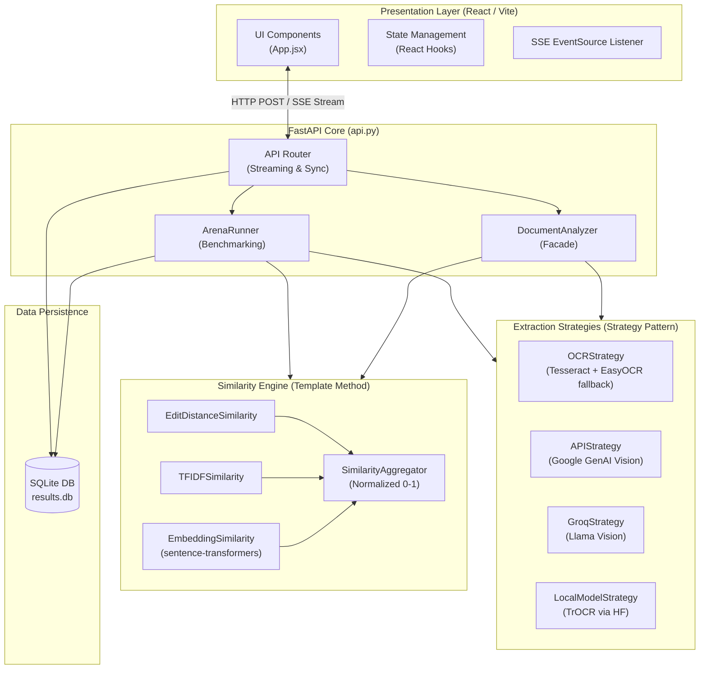

# System Architecture & Design

The Document Similarity Analyzer is strictly designed adhering to **Object-Oriented Programming (OOP)** principles to remain modular, scalable, and easily extensible. The system utilizes a decoupled React frontend and a FastAPI backend.

## 🏗 Component Overview

---

## 🛠 OOP Design Patterns Implemented

The architecture leverages classic Gang of Four (GoF) design patterns to establish highly decoupled dependencies.

### 1. Strategy Pattern (`models/extraction/`)
* **Problem:** The system requires multiple vastly different methods to extract text (Traditional OCR algorithms, Cloud LLM Vision APIs, Local Hugging Face ML models) that need to be hot-swapped by the user.
* **Solution:** An abstract interface `ExtractionStrategy` defines a common `extract_text` method. Concrete implementations (`OCRStrategy`, `APIStrategy`, `GroqStrategy`) inherit this interface. The calling context knows nothing about the underlying HTTP requests or PyTorch logic.

### 2. Factory Pattern (`models/extraction/factory.py`)
* **Problem:** Instantiating complex strategy dependencies based on dynamic string inputs from the frontend requires centralized logic.
* **Solution:** `StrategyFactory.create(mode, **kwargs)` accepts the UI's string input and returns the correct `ExtractionStrategy` instance. It dynamically handles necessary parameter routing, such as injecting the user's API key and selecting specific models (e.g., forcing `gemini-2.5-flash`).

### 3. Template Method Pattern (`models/similarity/`)
* **Problem:** Similarity computations use different mathematical formulas (Levenshtein distance versus Cosine Similarity), but their lifecycle is identical: validate input text -> compute raw score -> clamp bounds to `[0.0, 1.0]`.
* **Solution:** `SimilarityMetric(ABC)` implements the public `compute()` method which dictates the invariant step sequence (validation and clamping). It delegates the unique core computation to the abstract method `_compute_raw()`. Concrete classes only implement `_compute_raw()`.

### 4. Facade Pattern (`models/analyzer.py`)
* **Problem:** Managing extraction across multiple files (`doc1`, `doc2`) and routing results to the `SimilarityAggregator` would clutter the FastAPI endpoints.
* **Solution:** `DocumentAnalyzer` provides a single entry point (`analyze()`) that orchestrates the entire pipeline, hiding the complexity of strategy execution and multi-metric aggregation from the routing layer.

---

## 🔄 Frontend-Backend Interaction

The React frontend communicates with the FastAPI backend using standard HTTP APIs and Server-Sent Events (SSE).

### API Endpoints
1. **`/api/analyze/stream`**: Used by the Microscope. Receives `multipart/form-data` (images/PDFs, mode, api_key). It returns an SSE stream yielding real-time logs (`type: "log"`) and terminates with the final aggregated JSON result (`type: "done"`).
2. **`/api/arena/stream`**: Used by the Arena. Receives benchmarking configuration. Streams progress logs per file and ultimately returns the computed leaderboard.
3. **`/api/history` & `/api/history/save`**: Standard synchronous JSON endpoints reading and writing to the SQLite `results.db`.

---

## ⚙️ Pipelines & Data Flow

### OCR Pipeline (Input to Text)
1. User uploads a PDF or Image.
2. `FileHandler` intercepts the file. If PDF, it uses `pymupdf` to render each page as a PIL image.
3. The image is passed to `OCRStrategy`.
4. **Tesseract First:** The system attempts to extract text using `pytesseract`.
5. **EasyOCR Fallback:** If Tesseract fails, or specifically if the document is flagged as *handwritten*, the system falls back to `EasyOCR` (which utilizes PyTorch internally for superior handwritten recognition).
6. **Cleaning:** Extracted text is fed through `TextPreprocessor` to strip non-printable characters and normalize whitespace.

### Embedding Pipeline (Text to Similarity)
1. Two normalized strings enter `EmbeddingSimilarity`.
2. The system checks for the local model cache in `~/.cache/huggingface/hub/`.
3. An environment variable `HF_HUB_OFFLINE=1` is injected to prevent the `sentence-transformers` library from pinging the Hugging Face API to check for updates, saving significant latency.
4. The strings are passed to `all-MiniLM-L6-v2`, which returns two high-dimensional tensor arrays.
5. The PyTorch `util.cos_sim()` calculates the cosine similarity between the tensors.

---

## 🛡 Failure Handling Paths

- **Missing Tesseract (`OCRStrategy`):** If the OS path configuration for Tesseract is missing, the system catches the `TesseractNotFoundError` and seamlessly degrades to EasyOCR, logging a warning to the SSE stream.
- **Connection Resets (`EmbeddingSimilarity`):** Hugging Face Hub `ConnectionResetError(10054)` timeouts are mitigated by hardcoding offline mode (`HF_HUB_OFFLINE=1`), ensuring evaluations rely solely on local caches.
- **Model Silent Failures (`APIStrategy`):** Legacy Google Generative AI SDKs often failed silently (returning empty strings for images). The architecture mitigates this by strictly utilizing the modern `google.genai` SDK and packing image bytes specifically into `types.Part.from_bytes()`.
- **Bad API Keys:** Strategies catch HTTP 401/403s and bubble them up to the FastAPI router, which safely terminates the SSE stream and passes the exact error message to the React UI for display.
